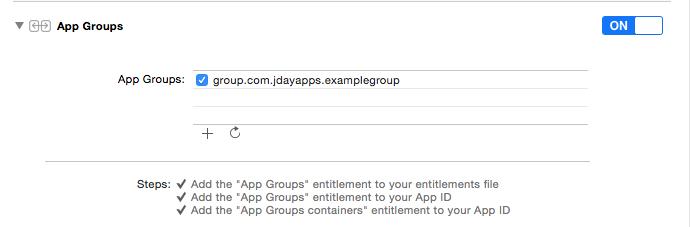

## App Groups Example ##

This is an example project containing a very simple App Group with 2 apps.

Both apps can share an `NSUserDefaults` database, referenced by `suiteName`, the app group name.

The main/parent app has a class, `SettingsManager`, that deals with the shared database and manages available settings. When the app is launched, `SettingsManager` sets properties for settings that `ViewController` is interested in. If the app resumes from the background, `SettingsManager` also sends a notification to update settings.

### Adding App Groups to a project ###

App groups can be added in your project target's <b>Capabilities</b> section by turning on  <b>App Groups</b>:

### Shared NSUserDefaults Example ###

To reference the shared `NSUserDefaults`:

    let APP_GROUP_SUITE: String = "group.com.jdayapps.examplegroup"
    let suiteDefaults: NSUserDefaults = NSUserDefaults(suiteName: APP_GROUP_SUITE)!

### Apple Documentation ###

Some hints at how to achieve this are available in the App Extension Programming Guide here:
https://developer.apple.com/library/prerelease/ios/documentation/General/Conceptual/ExtensibilityPG/ExtensionScenarios.html#//apple_ref/doc/uid/TP40014214-CH21-SW6